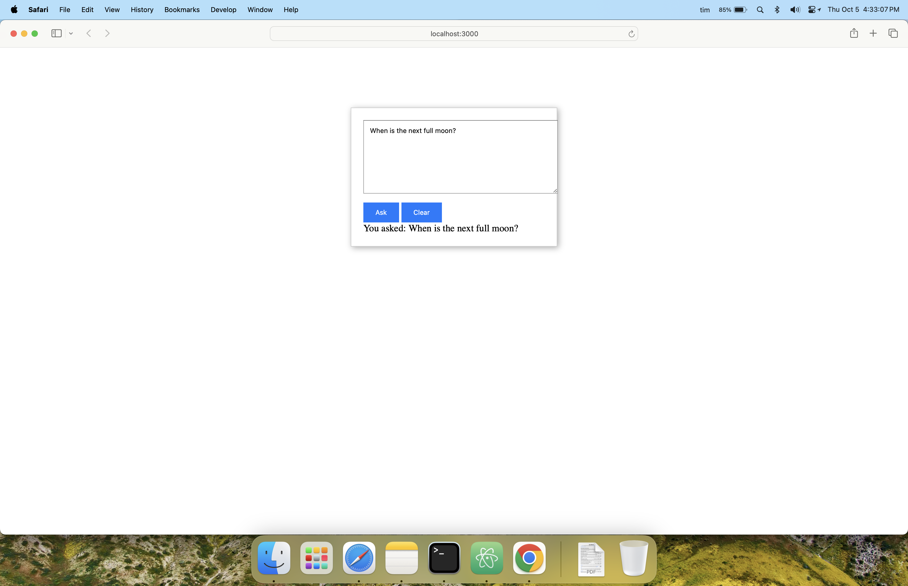

# intelligent_assistant

intelligent_assistant

## Quick Start


```

cd voice


file:///Users/tim/code/intelligent_assistant/voice/public/index.html


node convert_webm_to_m4a.js recordings/chrome_recording.webm


```


```
git clone https://github.com/timxor/intelligent_assistant.git
cd intelligent_assistant
npm install
nodemon server.js
http://localhost:3000/
```





